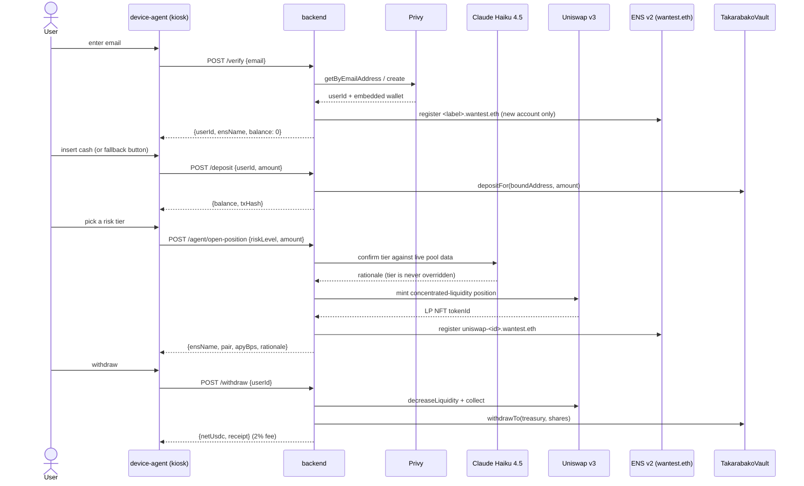

# Takarabako (宝箱)

An ATM-style cash-in kiosk: verify your identity with just an email (Privy —
real embedded wallet, no seed phrase, no app), *then* insert cash, and it's
credited to an ENS-named on-chain wallet (`*.wantest.eth`) with optional
risk-tiered yield on real Uniswap v3 pools, chosen with a real Claude Haiku
4.5 call. Built for ETHGlobal Online 2026. Full product spec lives in
`takarabako-prd.md` (gitignored, local-only).

Nearly everything below is real, on Ethereum Sepolia — not a stub. See
[`DEPLOYMENTS.md`](./DEPLOYMENTS.md) for the full deployment history and
independent on-chain verification of each piece, and
[`FEEDBACK.md`](./FEEDBACK.md) for integration notes gathered along the way.

## Live deployments (Ethereum Sepolia, chain 11155111)

Our own four contracts are deployed **and independently verified on
Etherscan** (exact-match source, not just a bytecode match) — click through
to confirm:

| Contract | Address | Etherscan |
|---|---|---|
| `MockUSDC` | `0x6cc5f175810e61A56508049f0527BC75EB7e77e4` | [Verified ✅](https://sepolia.etherscan.io/address/0x6cc5f175810e61A56508049f0527BC75EB7e77e4#code) |
| `TakarabakoVault` | `0xD069D36Af7DF950EE87002Fc120B90eF5Ea3ce3D` | [Verified ✅](https://sepolia.etherscan.io/address/0xD069D36Af7DF950EE87002Fc120B90eF5Ea3ce3D#code) |
| `MockRiskToken (mAAVE)` | `0x9c57968055d77d765e4EF1E4F138e9089295eD04` | [Verified ✅](https://sepolia.etherscan.io/address/0x9c57968055d77d765e4EF1E4F138e9089295eD04#code) |
| `MockRiskToken (mDOGE)` | `0x071436DC66a7C86a7c12Bc7E337A05fb46908c38` | [Verified ✅](https://sepolia.etherscan.io/address/0x071436DC66a7C86a7c12Bc7E337A05fb46908c38#code) |

Everything else the app talks to is a canonical, already-verified deployment
we don't own — real Uniswap v3 (Factory/NPM/WETH9), real ENS v2 Beta
(ETHRegistry/ETHRegistrar/VerifiableFactory), and our own `wantest.eth`
subname registry deployed via that factory. Full addresses, how each was
independently confirmed on-chain (not just trusting a tx receipt), and the
per-risk-tier pool addresses are all in [`DEPLOYMENTS.md`](./DEPLOYMENTS.md).

Live app deployment:

| Component | URL |
|---|---|
| Kiosk demo | https://takarabako-kiosk.netlify.app |

## Layout

- **`contracts/`** — Foundry workspace: `MockUSDC`, mock risk-tier tokens,
  and `TakarabakoVault` (mock-yield ERC-4626-flavored vault).
- **`backend/`** — Node/TypeScript orchestrator: real Privy identity, real
  ENS v2 subname registration, real vault deposit/withdraw, real per-user
  Uniswap v3 position open/exit, real Claude Haiku 4.5 pool-selection
  rationale.
- **`device-agent/`** — kiosk page for the Raspberry Pi 4 touchscreen, plus
  the software bridge for a real TB74 pulse bill acceptor (`gpio/`).

## System flow



## Quickstart

```bash
# contracts
cd contracts && forge install --no-git && forge test

# backend — needs real Sepolia RPC/keys in .env; see DEPLOYMENTS.md
cd backend && npm install && cp .env.example .env && npm run dev

# kiosk (separate shell)
cd device-agent && cp public/config.example.js public/config.js && node server.js   # http://localhost:8080
```

Treasury wallet is a testnet-only burner key — check its Sepolia ETH
balance before running anything that spends gas; it runs dry easily at
hackathon pace.
