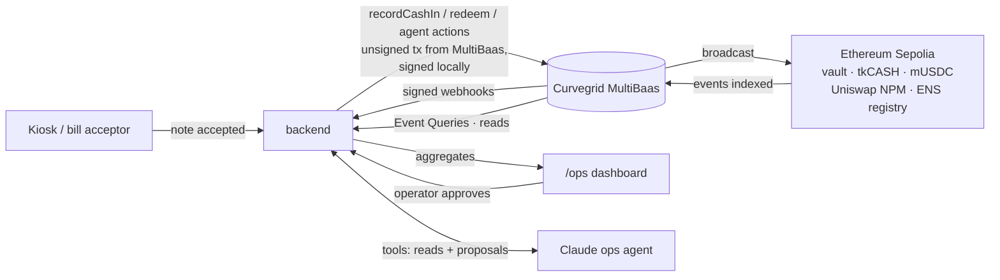
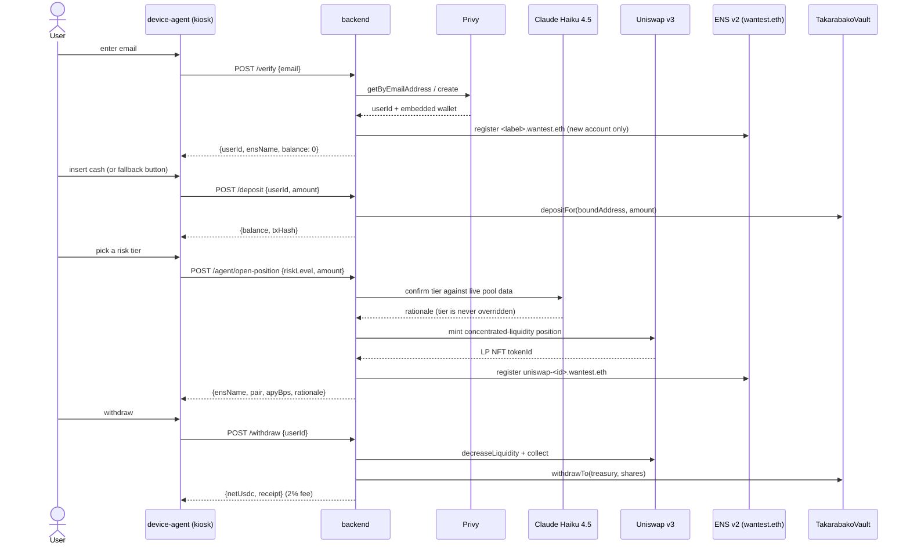

# Takarabako (宝箱)

**Takarabako turns banknotes into on-chain money: insert cash at a kiosk and it
becomes a yield-bearing balance and a tokenized cash receipt (tkCASH) on
Ethereum, with Curvegrid MultiBaas indexing every flow for a treasury
dashboard and a policy-bound AI agent.**

An ATM-style cash-in kiosk: verify your identity with just an email (Privy —
real embedded wallet, no seed phrase, no app), *then* insert cash, and it's
credited to an ENS-named on-chain wallet (`*.wantest.eth`) with optional
risk-tiered yield on real Uniswap v3 pools, chosen with a real Claude Haiku
4.5 call. Built for ETHGlobal Online 2026. Full product spec lives in
`takarabako-prd.md` (gitignored, local-only).

Nearly everything below is real, on Ethereum Sepolia — not a stub. See
[`DEPLOYMENTS.md`](./DEPLOYMENTS.md) for the full deployment history and
independent on-chain verification of each piece, and
[`FEEDBACK.md`](./FEEDBACK.md) for integration notes gathered along the way.

## Live deployments (Ethereum Sepolia, chain 11155111)

Our own four contracts are deployed **and independently verified on
Etherscan** (exact-match source, not just a bytecode match) — click through
to confirm:

| Contract | Address | Etherscan |
|---|---|---|
| `MockUSDC` | `0x6cc5f175810e61A56508049f0527BC75EB7e77e4` | [Verified ✅](https://sepolia.etherscan.io/address/0x6cc5f175810e61A56508049f0527BC75EB7e77e4#code) |
| `TakarabakoVault` | `0xD069D36Af7DF950EE87002Fc120B90eF5Ea3ce3D` | [Verified ✅](https://sepolia.etherscan.io/address/0xD069D36Af7DF950EE87002Fc120B90eF5Ea3ce3D#code) |
| `MockRiskToken (mAAVE)` | `0x9c57968055d77d765e4EF1E4F138e9089295eD04` | [Verified ✅](https://sepolia.etherscan.io/address/0x9c57968055d77d765e4EF1E4F138e9089295eD04#code) |
| `MockRiskToken (mDOGE)` | `0x071436DC66a7C86a7c12Bc7E337A05fb46908c38` | [Verified ✅](https://sepolia.etherscan.io/address/0x071436DC66a7C86a7c12Bc7E337A05fb46908c38#code) |

Everything else the app talks to is a canonical, already-verified deployment
we don't own — real Uniswap v3 (Factory/NPM/WETH9), real ENS v2 Beta
(ETHRegistry/ETHRegistrar/VerifiableFactory), and our own `wantest.eth`
subname registry deployed via that factory. Full addresses, how each was
independently confirmed on-chain (not just trusting a tx receipt), and the
per-risk-tier pool addresses are all in [`DEPLOYMENTS.md`](./DEPLOYMENTS.md).

Live app deployment:

| Component | URL |
|---|---|
| Kiosk demo | https://takarabako-kiosk.netlify.app |

## Curvegrid MultiBaas — all three tracks

One build covers the three Curvegrid prizes, with MultiBaas as the
backend's contract layer and indexer:

| Track | What we built | Where |
|---|---|---|
| **RWA tokenization** | **tkCASH** — a token that is a claim on one US dollar of banknotes in a specific kiosk. Minted when a note is accepted, burned when cash leaves; supply always equals the on-chain kiosk reserve. Operator counts (`attestReserve`) are proof-of-reserve checkpoints — a mismatch freezes that kiosk's minting. Transfers need both sides allowlisted (Privy-verified), respect a daily limit and a global pause. | `contracts/src/TakarabakoCashReceipt.sol`, `backend/src/cashReceipt.ts` |
| **Digital asset dashboard** | **`/ops`** — proof of reserve per kiosk, tkCASH backing, vault coverage, treasury gas, banknote mix, daily cash in/out, holders and concentration, vault depositors, Uniswap positions, a live event feed and action items. | `frontend/app/ops/`, `backend/src/routes/dashboard.ts` |
| **AI agent** | A **treasury ops agent** (Claude) that answers operators from live MultiBaas data and can only *propose* actions — fund the yield reserve, set APY, pause a kiosk, mint float. Hard limits are enforced in code; a human approves; approval executes through MultiBaas. A monitor watches webhook events and wakes the agent on anomalies. | `backend/src/opsAgent.ts`, `policy.ts`, `opsMonitor.ts` |

### How we used MultiBaas

- **Contract calls and unsigned transactions.** Every tkCASH write and every
  approved agent action is built by MultiBaas's contract API from the
  uploaded ABI, returned unsigned, signed locally with the treasury key, and
  broadcast through `POST /chains/ethereum/transactions/submit`. The key
  never leaves the backend and no Cloud Wallet is needed
  (`backend/src/multibaas.ts`, `mbSend`).
- **Reads** of the vault, tkCASH and mUSDC go through the same API
  (`mbCall`), including the customer's live vault value on `/position`.
- **Address aliases** name the contracts (`vault`, `tkcash`, `musdc`,
  `treasury`) and each new customer's wallet (their ENS label).
- **Saved Event Queries** power the dashboard: `cash_in_by_kiosk`,
  `cash_in_by_denomination`, `tkcash_holders` (balances rebuilt from
  Transfer events with `add`/`subtract` aggregators), `deposits_by_user`,
  `withdrawals`, `reserve_attestations`.
- **Signed webhooks** stream every event to `/webhooks/multibaas`
  (HMAC-SHA256 over body + timestamp, verified, replays rejected) into a
  Postgres event log that feeds the flows chart, the live feed and the
  agent's monitor.
- `npm run mb:setup` does all of the setup idempotently: five ABIs (the
  free tier's cap), aliases, links from the latest block, the queries and
  the webhook.


```mermaid
flowchart LR
    Kiosk[Kiosk / bill acceptor] -->|note accepted| API[backend]
    API -->|recordCashIn / redeem / agent actions<br/>unsigned tx from MultiBaas,<br/>signed locally| MB[(Curvegrid MultiBaas)]
    MB -->|broadcast| Chain[Ethereum Sepolia<br/>vault · tkCASH · mUSDC<br/>Uniswap NPM · ENS registry]
    Chain -->|events indexed| MB
    MB -->|signed webhooks| API
    MB -->|Event Queries · reads| API
    API -->|aggregates| Dash["/ops dashboard"]
    API <-->|tools: reads + proposals| Agent[Claude ops agent]
    Dash -->|operator approves| API
```

### Team

- **belulok** — [github.com/belulok](https://github.com/belulok)
- **nizarsyahmi37** — [github.com/nizarsyahmi37](https://github.com/nizarsyahmi37)
- **AqilJaafree** — [github.com/AqilJaafree](https://github.com/AqilJaafree)

### Our experience with MultiBaas

See the MultiBaas section of [`FEEDBACK.md`](./FEEDBACK.md#feedback-curvegrid-multibaas)
for what worked, what tripped us up, and suggestions.

## Layout

- **`contracts/`** — Foundry workspace: `MockUSDC`, mock risk-tier tokens,
  `TakarabakoVault` (mock-yield ERC-4626-flavored vault) and
  `TakarabakoCashReceipt` (tkCASH).
- **`backend/`** — Node/TypeScript orchestrator: real Privy identity, real
  ENS v2 subname registration, real vault deposit/withdraw, real per-user
  Uniswap v3 position open/exit, real Claude Haiku 4.5 pool-selection
  rationale.
- **`frontend/`** — Next.js web app: the customer app (Privy email-code
  login, live balance, quick-deposit QR, yield, withdraw), `/kiosk`, the
  box's new screen, `/deposit`, the public cash-deposit terminal, and
  `/ops`, the treasury dashboard. See [`frontend/README.md`](./frontend/README.md).
- **`device-agent/`** — kiosk page for the Raspberry Pi 4 touchscreen, plus
  the software bridge for a real TB74 pulse bill acceptor (`gpio/`).

## System flow


```mermaid
sequenceDiagram
    actor User
    participant Kiosk as device-agent (kiosk)
    participant API as backend
    participant Privy
    participant Claude as Claude Haiku 4.5
    participant Uniswap as Uniswap v3
    participant ENS as ENS v2 (wantest.eth)
    participant Vault as TakarabakoVault

    User->>Kiosk: enter email
    Kiosk->>API: POST /verify {email}
    API->>Privy: getByEmailAddress / create
    Privy-->>API: userId + embedded wallet
    API->>ENS: register <label>.wantest.eth (new account only)
    API-->>Kiosk: {userId, ensName, balance: 0}

    User->>Kiosk: insert cash (or fallback button)
    Kiosk->>API: POST /deposit {userId, amount}
    API->>Vault: depositFor(boundAddress, amount)
    API-->>Kiosk: {balance, txHash}

    User->>Kiosk: pick a risk tier
    Kiosk->>API: POST /agent/open-position {riskLevel, amount}
    API->>Claude: confirm tier against live pool data
    Claude-->>API: rationale (tier is never overridden)
    API->>Uniswap: mint concentrated-liquidity position
    Uniswap-->>API: LP NFT tokenId
    API->>ENS: register uniswap-<id>.wantest.eth
    API-->>Kiosk: {ensName, pair, apyBps, rationale}

    User->>Kiosk: withdraw
    Kiosk->>API: POST /withdraw {userId}
    API->>Uniswap: decreaseLiquidity + collect
    API->>Vault: withdrawTo(treasury, shares)
    API-->>Kiosk: {netUsdc, receipt} (2% fee)
```

## Quickstart

```bash
# contracts
cd contracts && forge install --no-git && forge test

# backend — needs real Sepolia RPC/keys in .env; see DEPLOYMENTS.md
cd backend && npm install && cp .env.example .env
npm run services   # Postgres + Redis without Docker (or: docker compose up -d)
npm run dev        # http://localhost:4000

# web app + /kiosk + /ops (separate shell)
cd frontend && npm install && npm run dev   # http://localhost:3000

# Pi kiosk page (separate shell)
cd device-agent && cp public/config.example.js public/config.js && node server.js   # http://localhost:8080
```

### MultiBaas setup

1. Create a free Sepolia deployment at [console.curvegrid.com](https://console.curvegrid.com)
   and an admin API key (Admin → API Keys). Put them in `backend/.env` as
   `MULTIBAAS_URL` and `MULTIBAAS_API_KEY`. No CORS setup is needed: the
   browser never calls MultiBaas; the dashboard goes through the backend.
2. Deploy tkCASH and put its address in `CASH_RECEIPT_ADDRESS`:
   ```bash
   cd contracts
   KIOSK_ID=kl-sentral-01 forge script script/DeployCashReceipt.s.sol --rpc-url $RPC_URL --broadcast --private-key $PRIVATE_KEY
   ```
3. Expose the backend for webhooks, e.g. `cloudflared tunnel --url http://localhost:4000`,
   and set `PUBLIC_BACKEND_URL` to the tunnel URL.
4. `cd contracts && forge build && cd ../backend && npm run mb:setup` —
   uploads the ABIs, links addresses, saves the queries and registers the
   webhook. Copy the printed `MULTIBAAS_WEBHOOK_SECRET` into `.env` and
   restart the backend.
5. Set `OPS_ADMIN_TOKEN` (a long random string) to use the agent and approve
   proposals on `http://localhost:3000/ops`.

### Testing

```bash
cd contracts && forge test          # vault + tkCASH (18 tests, incl. a supply == reserve fuzz)
cd backend && npm test              # needs Postgres (npm run services); 40 tests: webhook
                                    # signatures, tkCASH encoding, policy limits, proposal
                                    # lifecycle with the executor stubbed, monitor rules, …
cd backend && npm run typecheck
```

End to end: log in at the kiosk and insert a note (or use the test-deposit
button), then check `/ops` — a CashIn arrives by webhook, the reserve and
holders update. Ask the agent "Is the yield reserve sufficient?" (grounded
answer + tool trace), then "Raise APY to 50%" (policy rejects it), then "Top
up the yield reserve with 100 USDC" (pending → Approve → the tx appears in
MultiBaas and the feed).

Treasury wallet is a testnet-only burner key — check its Sepolia ETH
balance before running anything that spends gas; it runs dry easily at
hackathon pace.
